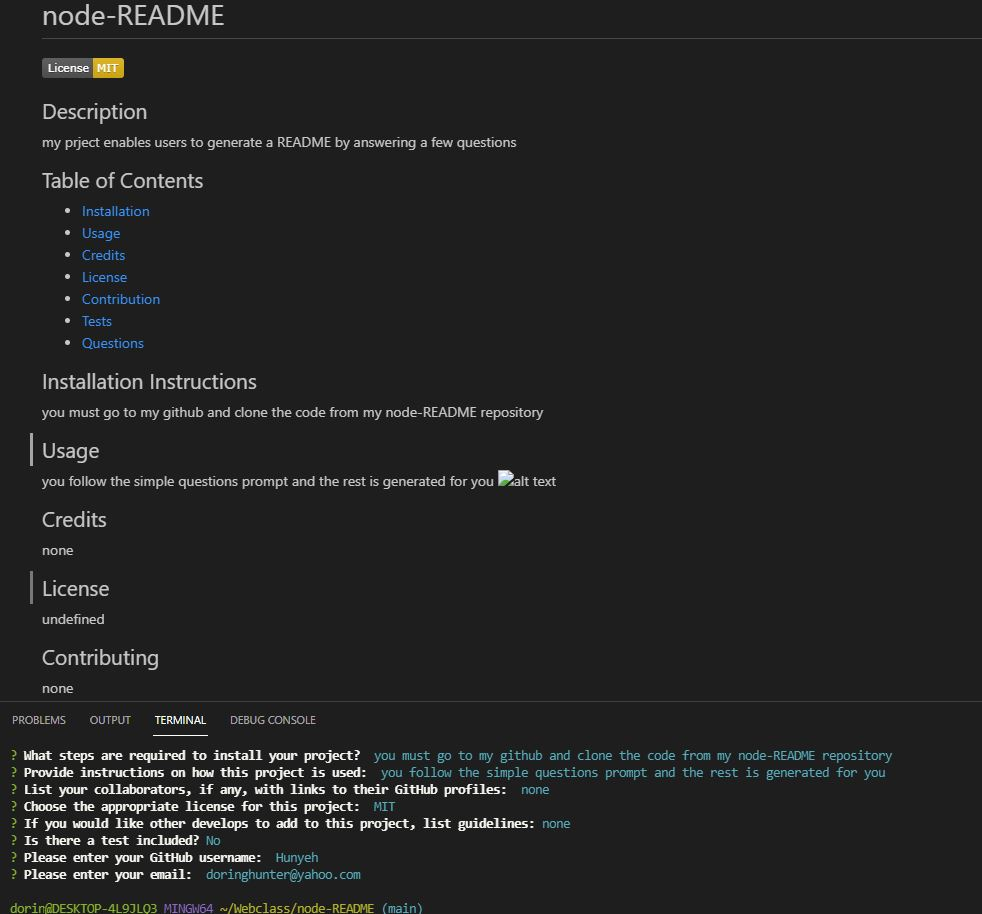

# node-README

## Description
Allows the user to generate a README file using only the command line.

## Table of Contents  
* [Installation](#installation)
* [Usage](#usage)
* [Credits](#credits)
* [License](#license)
* [Contribution](#contribution)
* [Tests](#tests)
* [Questions](#questions)

## Installation 
Go to my github account and clone my repo to your local computer.

## Usage
Simply follow the command line questions after entering "node index".
<!--  -->

## Credits
none 

## License
  GNU GPL v3

## Contribution
no

## Tests
false

## Questions
undefined
   
  Find me on GitHub 🏆: [Hunyeh](https://github.com/Hunyeh)
   
  ✉️ If any additional questions, email me @ : doringhunter@yahoo.com
  